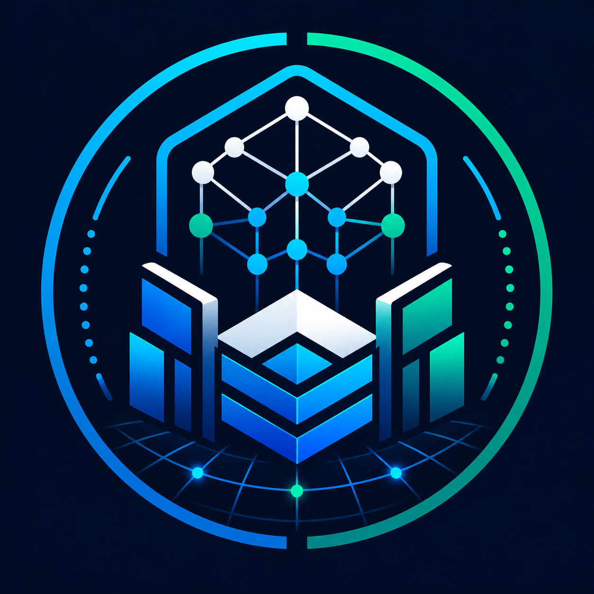

<p align="center">
  
</p>

# Best Enterprise AI

**Best Enterprise AI** is a living field guide for building, operating, securing, and scaling Enterprise AI systems, with special focus on agentic AI, enterprise coding agents, AI-native SDLC, governed RAG, production inference, and agent operations.

This profile treats Enterprise AI as an operating model, not a single chatbot. The enterprise stack includes strategy, platform engineering, model governance, inference infrastructure, data access, agent workflows, IDE and CLI agents, human approval, security, red teaming, observability, cost control, and organizational change.

## Mission

Best Enterprise AI exists to help leaders and builders answer one practical question:

> How do we turn AI from scattered experiments into secure, reliable, measurable enterprise systems?

The answer is a layered architecture:

1. **Enterprise goals** - measurable business outcomes, acceptable risk, owner accountability.
2. **Agentic workflows** - agents, routines, skills, tools, prompts, graphs, memory, RAG, and human checkpoints.
3. **AI-native SDLC** - IDE agents, CLI agents, agentic CI/CD, test harnesses, review harnesses, and sandboxed automation.
4. **Runtime infrastructure** - model gateways, inference engines, vLLM, caching, routing, evals, tracing, and SRE.
5. **Security and governance** - identity, least privilege, policy, guardrails, audit trails, red teaming, and incident response.
6. **Operating model** - agentic teams, shared platform services, enablement, standards, controls, and continuous improvement.

## Core Domains

| Domain | What It Covers |
| --- | --- |
| Agentic AI | Autonomous and semi-autonomous systems that plan, call tools, use memory, delegate tasks, and complete workflows. |
| Enterprise IDE and CLI Agents | Claude Code, OpenAI Codex, Kiro, Antigravity, and other agentic development surfaces for real codebases. |
| Agent Workflows | Plan-act-review loops, graph orchestration, handoffs, approvals, retries, compensating actions, and task decomposition. |
| Harness Engineering | Test harnesses, eval harnesses, prompt harnesses, tool harnesses, red-team harnesses, replay harnesses, and CI gates. |
| Inference and Serving | Model gateways, vLLM, batch and online inference, model routing, GPU utilization, latency, throughput, quantization, and fallback. |
| Cache and Memory | Prompt caching, KV cache, semantic cache, tool-result cache, short-term state, long-term memory, user memory, and policy-bound retention. |
| Prompts, Tools, Skills, Routines | Prompt contracts, reusable skills, tool schemas, execution routines, MCP servers, connectors, and playbooks. |
| Graphs and RAG | LangGraph-style orchestration, retrieval graphs, agentic RAG, knowledge graphs, provenance, citations, and grounding evaluation. |
| SRE for Agent AI | SLIs, SLOs, incident response, rollout controls, trace replay, safety alerts, cost alerts, model degradation response. |
| Models for Enterprise AI | Proprietary, open-weight, self-hosted, domain-tuned, small specialized, multimodal, code, embedding, reranking, and guard models. |
| Agentic Organizations | How enterprises reorganize work around AI teammates, review loops, accountable owners, and agent-assisted delivery. |
| Agentic CI/CD | AI-assisted issue triage, code generation, PR review, test creation, release notes, deployment analysis, rollback support. |
| Security and Red Teaming | Prompt injection, excessive agency, tool abuse, data exfiltration, supply chain risk, model abuse, and adversarial evals. |
| Sandboxes and Sandbox Agents | Constrained execution environments for coding agents, browser agents, shell agents, data agents, and customer-specific agents. |
| Guardrails | Input rails, output rails, tool rails, policy engines, data loss prevention, approval gates, and post-action verification. |

## Recommended Repository Map

- [Enterprise AI Reference Architecture](docs/reference-architecture.md)
- [Agentic Enterprise SDLC](docs/agentic-enterprise-sdlc.md)
- [Security, Red Teaming, and Guardrails](docs/security-red-teaming-guardrails.md)
- [Models, Inference, vLLM, and Caching](docs/models-inference-vllm-cache.md)
- [Tools, IDEs, CLIs, Skills, and Routines](docs/tools-ides-clis-skills-routines.md)
- [SRE for Agentic AI](docs/sre-for-agentic-ai.md)
- [Adoption Roadmap](docs/adoption-roadmap.md)
- [Executable Examples](examples/README.md)

## Enterprise AI Reference Stack

```text
Business layer
  outcomes | workflows | policy | risk appetite | owners | audit

Experience layer
  copilots | assistants | agentic IDEs | chat surfaces | service desks | APIs

Agent layer
  planners | workers | critics | routers | retrievers | tool users | supervisors

Workflow layer
  graphs | routines | skills | prompt contracts | approvals | retries | replay

Knowledge layer
  RAG | agentic RAG | vector stores | knowledge graphs | document pipelines | memory

Tool layer
  MCP | internal APIs | databases | SaaS | shell | browser | ticketing | CI/CD

Model layer
  frontier models | open models | code models | embedding models | rerankers | guard models

Inference layer
  gateways | vLLM | batching | KV cache | semantic cache | routing | rate limits

Control layer
  identity | policy | sandbox | secrets | DLP | logging | evals | red team | governance

Operations layer
  SLOs | tracing | observability | incident response | cost | drift | change management
```

## Agentic Enterprise Patterns

### 1. Human-Led Agent Workflow

Best for high-impact enterprise work.

```text
human goal -> agent plan -> human approval -> tool execution -> validation -> human acceptance
```

Use this for source code changes, infrastructure changes, customer communications, financial decisions, legal workflows, and any action that writes to a system of record.

### 2. Supervisor-Worker Agent Workflow

Best for complex work that can be decomposed.

```text
supervisor agent
  -> research agent
  -> coding agent
  -> test agent
  -> security-review agent
  -> release-note agent
  -> human reviewer
```

This pattern requires state, traceability, role-specific permissions, and clear exit criteria.

### 3. Agentic RAG Workflow

Best when retrieval is not a single search.

```text
question -> classify intent -> plan retrieval -> query multiple stores -> inspect evidence
         -> follow-up retrieval -> synthesize -> cite sources -> confidence score -> answer
```

Agentic RAG is useful for enterprise knowledge bases, customer support, regulated evidence workflows, engineering diagnostics, and audit research.

### 4. Agentic CI/CD Workflow

Best for AI-assisted delivery.

```text
issue -> spec -> implementation branch -> tests -> security checks -> PR review
      -> deploy plan -> rollout monitor -> rollback recommendation
```

The agent should create artifacts humans can inspect: plans, diffs, test results, risk notes, and deployment evidence.

## Tools and Platforms

This repo tracks the enterprise-relevant capabilities of the current agentic development ecosystem.

| Tool / Platform | Enterprise Use |
| --- | --- |
| OpenAI Codex | Local, IDE, cloud, and CI/CD coding agent workflows; useful for implementation, review, migration, and repeatable engineering tasks. |
| Claude Code | Terminal, IDE, GitHub Actions, SDK, and MCP-enabled coding workflows; strong fit for codebase analysis and agentic development automation. |
| Kiro | Agentic IDE patterns around specs, steering, hooks, MCP governance, and automated development workflows. |
| Google Antigravity | Agent-first development platform with IDE, CLI, SDK, subagents, scheduled tasks, and model routing patterns. |
| vLLM | High-throughput model serving with OpenAI-compatible APIs, production metrics, prefix/KV cache features, and GPU-efficient inference. |
| NVIDIA NeMo Guardrails | Dialog, input, output, topical, retrieval, jailbreak, and policy guardrails for LLM applications. |
| LangGraph | Durable graph orchestration, persistence, streaming, memory, and human-in-the-loop workflows. |
| OpenClaw / NemoClaw / OpenShell | Self-hosted and sandbox-oriented agent runtime patterns that deserve special enterprise security review before adoption. |
| MCP | Standardized tool/context protocol for connecting models and agents to tools, resources, prompts, and enterprise data systems. |

## Enterprise AI Maturity Model

| Level | State | Description |
| --- | --- | --- |
| 0 | Shadow AI | Unmanaged use of public tools, no inventory, no governance, unclear data exposure. |
| 1 | Controlled Copilots | Approved tools, basic policy, training, and limited productivity use cases. |
| 2 | Governed Assistants | Internal apps with RAG, access control, logging, evals, and business owners. |
| 3 | Agentic Workflows | Agents call tools, use memory, run in sandboxes, create artifacts, and require approvals for risky actions. |
| 4 | AI-Native SDLC | Agentic IDE/CLI/CI workflows support coding, tests, reviews, deployments, docs, and operations. |
| 5 | Agentic Enterprise | AI agents are part of operating processes with SLOs, auditability, incident response, continuous evaluation, and measurable ROI. |

## Non-Negotiable Enterprise Controls

- Every agent has an owner.
- Every tool has an allow-list, permission boundary, and audit trail.
- Every write action has policy, validation, and rollback strategy.
- Every production agent has evals, traces, cost controls, and incident runbooks.
- Every RAG answer can show provenance or explicitly say when evidence is insufficient.
- Every coding agent change goes through tests, review, and branch protection.
- Every sandbox has scoped filesystem, network, secret, and identity permissions.
- Every model path has a fallback and degradation mode.
- Every red-team finding becomes a regression test.

## Primary References

- OpenAI Agents and AgentKit: https://platform.openai.com/docs/guides/agents
- OpenAI Codex and code generation: https://platform.openai.com/docs/guides/code-generation
- OpenAI Codex CLI overview: https://help.openai.com/en/articles/11096431
- Anthropic Claude Code setup: https://docs.anthropic.com/en/docs/claude-code/getting-started
- Anthropic MCP overview: https://docs.anthropic.com/en/docs/mcp
- Kiro docs: https://kiro.dev/docs/
- Kiro hooks: https://kiro.dev/docs/hooks/
- Google Antigravity docs: https://www.antigravity.google/docs/files
- vLLM OpenAI-compatible server: https://docs.vllm.ai/en/latest/serving/online_serving/openai_compatible_server/
- NVIDIA NeMo Guardrails: https://docs.nvidia.com/nemo/guardrails/
- LangGraph overview: https://docs.langchain.com/oss/python/langgraph
- OWASP Top 10 for LLM Applications: https://owasp.org/www-project-top-10-for-large-language-model-applications
- NIST Generative AI Profile, AI 600-1: https://nvlpubs.nist.gov/nistpubs/ai/NIST.AI.600-1.pdf
- MITRE ATLAS: https://atlas.mitre.org/
- CISA AI guidance: https://www.cisa.gov/ai

## Guiding Principle

Enterprise AI should feel powerful to users, boring to operators, and legible to auditors.

The best systems are not the flashiest demos. They are the systems that can be trusted after the demo: observable, testable, secure, recoverable, and useful enough that teams keep using them when nobody is watching.

## Starter Commands

Run the local examples:

```powershell
python -m py_compile examples\eval_harness.py examples\tool_contract_validator.py examples\red_team_harness.py examples\trace_replay.py examples\agent_slo_report.py
python examples\eval_harness.py evals\sample_eval_cases.jsonl
python examples\tool_contract_validator.py examples\sample_tool_contract.json
python examples\red_team_harness.py evals\sample_red_team_cases.jsonl
python examples\trace_replay.py examples\sample_traces.jsonl --trace-id trace-001
python examples\agent_slo_report.py examples\sample_traces.jsonl
```

Smoke-test a local OpenAI-compatible vLLM endpoint:

```powershell
.\examples\vllm_smoke_test.ps1 -BaseUrl http://127.0.0.1:8000 -Model meta-llama/Llama-3.1-8B-Instruct
```
