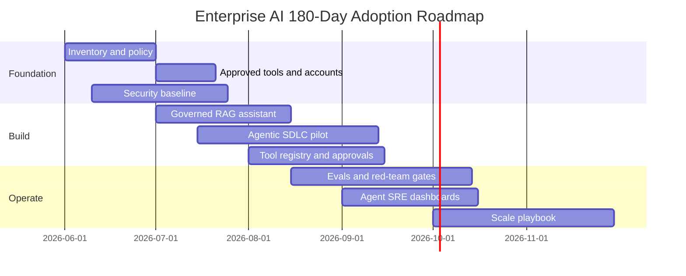
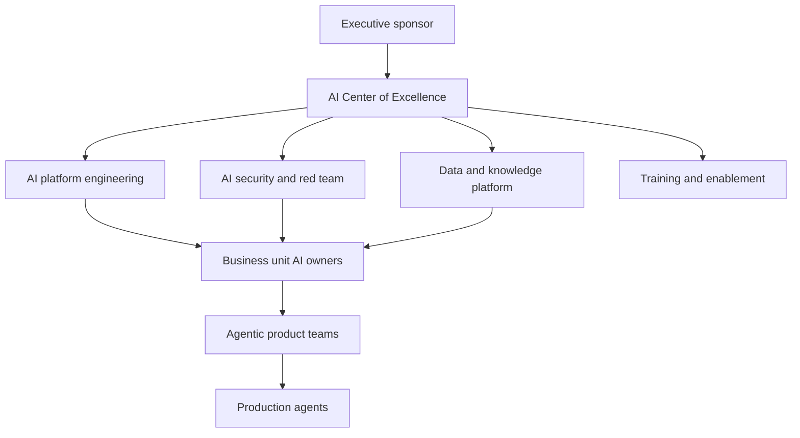

# Enterprise AI Adoption Roadmap

Enterprise AI succeeds when the organization advances through capability maturity in the right order. Do not start with autonomous agents that can write to production systems. Start with controlled value, build trust, and then expand permission.

## Phase 0: Inventory and Policy

Goals:

- Know where AI is already used.
- Define approved tools.
- Define data rules.
- Define risk tiers.
- Establish ownership.

Deliverables:

- AI system inventory.
- Approved tool list.
- Data classification guidance.
- Prompt and output handling policy.
- Model/provider policy.
- Security review checklist.
- Initial training.

Exit criteria:

- Teams know what they can use.
- Sensitive data rules are clear.
- Security has visibility.

## Phase 1: Controlled Copilots

Goals:

- Improve individual productivity.
- Reduce shadow AI.
- Learn common workflows.

Use cases:

- Drafting.
- Summarization.
- Code explanation.
- Test ideas.
- Internal Q&A with approved data.

Controls:

- Enterprise accounts.
- No secrets in prompts.
- Logging and retention policy.
- Approved model/provider list.
- User training.

Exit criteria:

- Measured productivity gains.
- Low incident rate.
- Clear user guidance.

## Phase 2: Governed Assistants and RAG

Goals:

- Build internal assistants connected to enterprise knowledge.
- Make answers grounded and auditable.

Use cases:

- Support knowledge assistant.
- Engineering docs assistant.
- Sales enablement assistant.
- Policy and compliance assistant.
- Incident knowledge assistant.

Controls:

- Access-aware retrieval.
- Citations.
- Grounding evals.
- Data freshness.
- Feedback loop.
- Owner dashboards.

Exit criteria:

- RAG answers have measurable quality.
- Retrieval respects permissions.
- Users can inspect sources.

## Phase 3: Agentic Workflows

Goals:

- Let agents complete bounded workflows.
- Introduce tool use with approval.

Use cases:

- Ticket triage.
- PR review.
- Documentation updates.
- Incident timeline generation.
- Report generation.
- Draft customer responses.

Controls:

- Tool registry.
- Least privilege.
- Human approval.
- Trace logging.
- Red-team tests.
- Rollback paths.

Exit criteria:

- Agents reliably complete bounded workflows.
- Tool calls are auditable.
- Red-team findings are remediated.

## Phase 4: AI-Native SDLC

Goals:

- Make agentic development normal and governed.
- Use AI across spec, code, test, review, release, and operations.

Use cases:

- Agentic IDE/CLI workflows.
- Agentic CI/CD.
- Test generation.
- Migration support.
- Security review.
- Release notes.
- Runbook updates.

Controls:

- Branch protection.
- Required tests.
- Agent commit conventions.
- CODEOWNERS.
- Prompt/model/tool change review.
- CI eval gates.

Exit criteria:

- AI-assisted changes are traceable.
- Quality improves or remains stable.
- Delivery speed improves without increasing incidents.

## Phase 5: Agentic Enterprise

Goals:

- Integrate agents into business operations.
- Run agents with SLOs, incident response, and continuous evaluation.

Use cases:

- Multi-agent operations workflows.
- Agent-assisted SRE.
- Agentic customer support.
- Agentic compliance workflows.
- Agentic finance or procurement workflows with strict approvals.
- Agentic organization design.

Controls:

- Agent SLOs.
- Risk dashboards.
- Continuous red teaming.
- Automated eval regression.
- Cost SRE.
- Policy-as-code.
- Enterprise-wide auditability.

Exit criteria:

- Agents are part of standard operating procedures.
- Controls are measurable.
- Business outcomes are visible.

## 90-Day Starter Plan

### Days 1-30

- Inventory AI usage.
- Approve tools and providers.
- Pick three high-value, low-risk workflows.
- Create prompt and data policies.
- Stand up eval and logging basics.

### Days 31-60

- Build one RAG assistant.
- Build one coding-agent workflow.
- Build one agentic business workflow.
- Create initial red-team tests.
- Define SLOs and cost dashboards.

### Days 61-90

- Add tool registry and approval flow.
- Add trace replay.
- Add CI eval gates.
- Roll out training.
- Publish internal Enterprise AI reference architecture.

## Executive Scorecard

- Business value delivered.
- Active governed AI users.
- Approved use cases in production.
- Percentage of AI systems with owners.
- Percentage of AI systems with evals.
- Percentage of agent tool calls audited.
- Red-team regression pass rate.
- Cost per successful task.
- Incident count and severity.
- Time saved or cycle-time reduction.

## Deep Dive: Adoption Roadmap Diagram



## Deep Dive: Program Backlog

| Epic | Deliverables | Owner |
| --- | --- | --- |
| AI governance | Policy, approved tools, model/provider standards, data rules | CIO / CISO |
| AI platform | Gateway, tool registry, eval store, observability, sandbox profiles | Platform engineering |
| RAG foundation | Ingestion pipeline, vector store, hybrid search, citations, retrieval evals | Data platform |
| Agentic SDLC | IDE/CLI standards, branch policy, PR templates, CI eval gates | Engineering productivity |
| Security | Threat model, red-team harness, guardrails, incident playbooks | Security engineering |
| SRE | SLIs, SLOs, dashboards, cost controls, on-call runbooks | SRE |
| Enablement | Training, examples, internal docs, office hours | AI center of excellence |

## Deep Dive: 30-60-90 Command Checklist

Days 1-30:

```powershell
New-Item -ItemType Directory -Force inventory, policies, training, evals | Out-Null
rg -n "openai|anthropic|claude|codex|kiro|antigravity|llm|agent|copilot" C:\work
```

Days 31-60:

```powershell
python examples\tool_contract_validator.py examples\sample_tool_contract.json
python examples\eval_harness.py evals\sample_eval_cases.jsonl
```

Days 61-90:

```powershell
python examples\red_team_harness.py evals\sample_red_team_cases.jsonl
python examples\agent_slo_report.py examples\sample_traces.jsonl
```

## Deep Dive: Organization Design



## Deep Dive: Investment Thesis

Enterprise AI investments should be evaluated by:

- Cycle-time reduction.
- Quality improvement.
- Risk reduction.
- Revenue enablement.
- Cost avoidance.
- Employee experience.
- Customer experience.
- Auditability.
- Reuse across business units.

Avoid investing only in demos. Invest in shared foundations that make the tenth use case cheaper and safer than the first.
