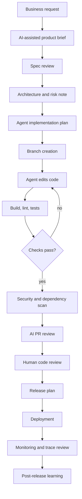

# Agentic Enterprise SDLC

Agentic software development is not just using an AI autocomplete tool. In the enterprise, it is a governed delivery system where agents help create requirements, code, tests, reviews, documentation, deployments, and operational evidence.

## SDLC Operating Model

```text
idea
  -> problem brief
  -> product spec
  -> architecture note
  -> implementation plan
  -> branch and task decomposition
  -> agent-assisted implementation
  -> test generation and execution
  -> security review
  -> PR review
  -> release plan
  -> rollout
  -> production monitoring
  -> incident learning
```

Agents can assist at every step, but accountable humans own the final decisions.

## Agentic IDE and CLI Roles

### OpenAI Codex

Enterprise use:

- Local code editing and command execution with approvals.
- Cloud task delegation for longer coding work.
- IDE and CLI workflows.
- CI/CD integration through SDK-style automation.
- Migration, test generation, refactoring, and PR review.

Controls:

- Use repo instructions such as `AGENTS.md`.
- Keep work in branches.
- Require tests and review before merge.
- Use sandboxed modes for execution.
- For privileged systems, use approval-first workflows.

### Claude Code

Enterprise use:

- Terminal-based codebase analysis and implementation.
- `CLAUDE.md` project guidance.
- MCP tool integration.
- GitHub Actions for issue/PR-triggered automation.
- Custom automation through Claude Code SDK patterns.

Controls:

- Store API keys in GitHub Secrets or enterprise secret managers.
- Limit GitHub Action permissions.
- Use explicit allowed and disallowed tools.
- Require branch protection and human review.
- Keep project memory concise, accurate, and non-secret.

### Kiro

Enterprise use:

- Specs for structured feature planning.
- Steering files for persistent project context.
- Hooks for automated agent or shell actions.
- MCP governance for tool access.
- Privacy and organization-level controls.

Controls:

- Treat hooks as automation code.
- Use pre-tool hooks to block unsafe actions.
- Govern MCP with allow-lists.
- Version specs, steering, and hook definitions.

### Google Antigravity

Enterprise use:

- Agent-first development workflows.
- IDE, CLI, SDK, subagents, scheduled tasks, and model routing patterns.
- Multi-agent task decomposition and recurring codebase checks.

Controls:

- Use scoped workspaces.
- Avoid broad filesystem access.
- Require confirmation for destructive commands.
- Use scheduled tasks only for bounded, observable checks.
- Keep model routing policy explicit.

## Agentic CI/CD Patterns

### 1. AI Issue Triage

Inputs:

- Issue title and body.
- Recent incidents.
- Component ownership map.
- Codeowners.
- Service catalog.

Outputs:

- Proposed labels.
- Suspected component.
- Questions for reporter.
- Risk level.
- Suggested owner.

### 2. AI Spec Generation

Inputs:

- Product brief.
- Existing docs.
- Constraints.
- Non-goals.

Outputs:

- Requirements.
- Acceptance criteria.
- Test plan.
- Risk notes.
- Rollout plan.

### 3. AI Implementation Branch

Rules:

- Agent works in a branch.
- Agent must produce a plan before edits.
- Agent must run relevant tests.
- Agent must summarize changes and risks.
- Human reviews before merge.

### 4. AI PR Review

Review dimensions:

- Correctness.
- Security.
- Test coverage.
- Backward compatibility.
- Performance.
- Observability.
- Migration risk.
- Documentation.

### 5. AI Release Assistant

Outputs:

- Release notes.
- Deployment checklist.
- Rollback plan.
- Known risks.
- Monitoring dashboard links.
- Owner approval record.

## Harness Engineering for SDLC

Harnesses make agent work repeatable and testable.

| Harness | Purpose |
| --- | --- |
| Prompt harness | Version prompts, inputs, expected behavior, and regression tests. |
| Tool harness | Validate tool schemas, permissions, dry-run behavior, and error handling. |
| Eval harness | Score outputs for correctness, grounding, safety, and format. |
| Code harness | Run build, tests, lint, static analysis, dependency checks, and mutation tests. |
| Review harness | Replay diffs through reviewers and compare findings. |
| Red-team harness | Test prompt injection, data leakage, tool abuse, and excessive agency. |
| Replay harness | Re-run past traces against new prompts, models, and policies. |

## Enterprise Branch Policy

Recommended defaults:

- No direct pushes to protected branches.
- Agent commits must identify the agent and human requester.
- Required checks include tests, security scans, and evals for AI-facing code.
- CODEOWNERS review for sensitive areas.
- Human approval for infrastructure, auth, payment, customer data, and production automation.

## Agent Output Contract

Every coding agent task should produce:

- Goal.
- Files changed.
- Tests run.
- Tests not run and why.
- Security considerations.
- Risk level.
- Rollback notes.
- Follow-up tasks.

## When Not to Use Agentic Automation

Avoid autonomous or lightly supervised agents when:

- The action is irreversible.
- The data is highly sensitive and controls are immature.
- The agent cannot be given least-privilege tools.
- There is no reliable validation signal.
- The organization cannot inspect or replay the agent trace.
- The business cannot tolerate residual prompt-injection risk.

## Deep Dive: Agentic SDLC Mermaid Diagram



## Deep Dive: Commands for Agentic Development Workstations

Use repo-local identity for this repository:

```powershell
git config user.name "bestenterpriseai"
git config user.email "security-or-devrel@example.com"
git remote -v
git status --short
```

Create a branch for every agent task:

```powershell
git checkout -b docs/agentic-sdlc-playbook
git status --short
```

Run basic document checks:

```powershell
rg -n "TODO|FIXME|SECRET|PASSWORD|API_KEY" .
rg -n "<<<<<<<|=======|>>>>>>>" .
```

For Python examples:

```powershell
python -m py_compile examples\eval_harness.py examples\tool_contract_validator.py examples\red_team_harness.py examples\trace_replay.py examples\agent_slo_report.py
```

## Deep Dive: GitHub Actions Pattern for Agentic CI

This workflow is intentionally generic. Replace commands with enterprise-approved test, security, and eval steps.

```yaml
name: enterprise-ai-docs-check

on:
  pull_request:
  push:
    branches: [main]

permissions:
  contents: read

jobs:
  checks:
    runs-on: ubuntu-latest
    steps:
      - uses: actions/checkout@v4
      - uses: actions/setup-python@v5
        with:
          python-version: "3.12"
      - name: Secret and conflict marker scan
        run: |
          ! grep -RInE "SECRET|PASSWORD|API_KEY|<<<<<<<|=======|>>>>>>>" .
      - name: Compile example scripts
        run: |
          python -m py_compile examples/*.py
      - name: Run sample eval harness
        run: |
          python examples/eval_harness.py evals/sample_eval_cases.jsonl
```

## Deep Dive: Agentic PR Template

```markdown
## Goal

## Agent / Human Roles

- Human requester:
- Agent/tool used:
- Reviewer:

## Changes

## Tests and Evals

- [ ] Unit tests
- [ ] Integration tests
- [ ] Security scan
- [ ] Prompt or RAG evals
- [ ] Red-team regression

## Risk

- Data touched:
- Tools used:
- Approval required:
- Rollback:

## Traceability

- Branch:
- Commit:
- Run ID:
- Prompt/model/tool versions:
```

## Deep Dive: Coding-Agent Guard Hook Example

This PowerShell example blocks high-risk commands unless the agent is running in an approved task. Wire it into your IDE, CLI, shell profile, or agent hook system only after testing.

```powershell
param(
  [string]$CommandText
)

$blocked = @(
  "git push --force",
  "Remove-Item -Recurse C:\",
  "kubectl delete",
  "terraform destroy",
  "aws iam",
  "az role assignment",
  "gcloud projects delete"
)

foreach ($pattern in $blocked) {
  if ($CommandText -like "*$pattern*") {
    Write-Error "Blocked high-risk command: $pattern"
    exit 42
  }
}

exit 0
```

## Deep Dive: SDLC Metrics

Track these before and after agent adoption:

- Lead time from issue to PR.
- PR review turnaround.
- Test coverage delta.
- Defect escape rate.
- Security finding rate.
- Change failure rate.
- Mean time to recovery.
- Documentation freshness.
- Developer satisfaction.
- Cost per accepted agent contribution.
