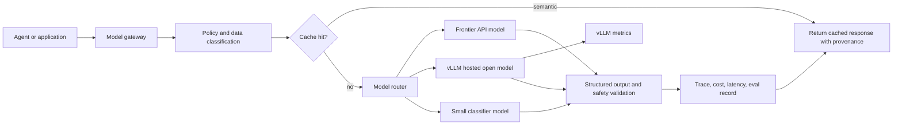
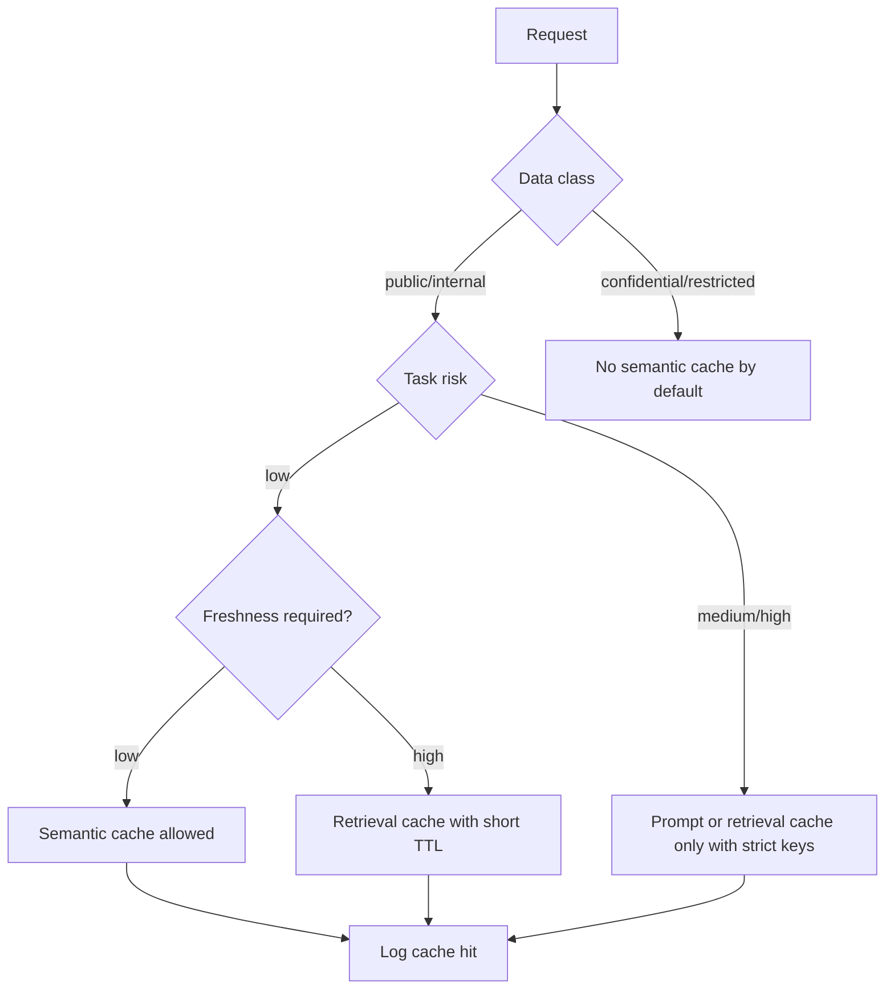

# Models, Inference, vLLM, and Caching

Enterprise AI model strategy is a portfolio problem. One model rarely satisfies all needs across cost, latency, accuracy, security, code ability, domain knowledge, multimodal input, deployment constraints, and audit requirements.

## Model Portfolio

| Model Class | Enterprise Use |
| --- | --- |
| Frontier reasoning models | Complex analysis, planning, coding, synthesis, high-value decisions. |
| Code models | Refactoring, migration, review, test creation, codebase Q&A, CI agents. |
| Small fast models | Classification, routing, extraction, guard checks, summarization. |
| Open-weight models | Self-hosted inference, data residency, latency control, cost control, customization. |
| Domain-tuned models | Specialized workflows with stable task distributions and eval data. |
| Embedding models | Search, RAG, similarity, clustering, memory. |
| Rerankers | Improve retrieval quality and citation relevance. |
| Guard models | Safety, jailbreak detection, content policy, topic control, PII detection. |
| Multimodal models | Documents, screenshots, diagrams, scanned forms, images, video, audio. |

## Model Gateway

The model gateway should be the policy and observability choke point.

Responsibilities:

- Provider abstraction.
- Model routing.
- Rate limiting.
- Token and cost accounting.
- Prompt and response logging policy.
- PII redaction.
- Request classification.
- Guard model calls.
- Caching.
- Fallback.
- Trace propagation.
- Tenant and environment isolation.

## Routing Policy

Example routing dimensions:

- Task type.
- Risk tier.
- Latency budget.
- Cost budget.
- Data classification.
- Required context length.
- Required output format.
- Tool-use need.
- Code vs non-code.
- Multimodal requirement.
- Regulated workload requirement.

Recommended pattern:

```text
request -> classify -> policy check -> route model -> execute -> validate -> fallback or return
```

## vLLM in Enterprise Inference

vLLM is useful for serving open and self-hosted models where high throughput and OpenAI-compatible APIs matter. Its documentation describes an OpenAI-compatible server supporting APIs such as chat completions, completions, responses, embeddings, and other serving endpoints depending on model type and version.

Enterprise uses:

- Self-hosting open-weight models.
- OpenAI-compatible internal model endpoint.
- GPU utilization optimization.
- Batch and online inference.
- Prefix/KV cache features.
- Production metrics and monitoring.
- Multi-model or multi-instance deployment patterns.

Operational controls:

- Put vLLM behind an enterprise gateway.
- Require authentication and authorization.
- Disable development endpoints in production.
- Monitor `/metrics`, latency, throughput, queue depth, GPU memory, and errors.
- Separate public, internal, and regulated workloads.
- Use network policy and firewall controls.
- Validate chat templates and generation config.
- Pin model versions and container images.
- Load test before production.

## Cache Types

| Cache | What It Stores | Benefit | Risk |
| --- | --- | --- | --- |
| Prompt cache | Reused prompt prefixes or provider-side cached input | Lower cost and latency | Cache keys can leak tenant or policy boundaries if poorly designed. |
| KV / prefix cache | Attention key-value state for repeated prefixes | Faster inference | Must be isolated by model, tenant, and prompt prefix policy. |
| Semantic cache | Similar request and response pairs | Lower cost for repeated questions | Can return stale or unauthorized answers. |
| Retrieval cache | Search results, rerank results, document chunks | Faster RAG | Must respect permissions and freshness. |
| Tool-result cache | API/database/tool responses | Lower tool load | Can hide state changes; needs TTL and invalidation. |
| Eval cache | Model outputs for benchmark inputs | Reproducible comparisons | Must pin prompt/model/tool versions. |

## Cache Governance

- Cache only what policy allows.
- Include tenant, user role, data class, prompt version, model version, and source version in cache keys where relevant.
- Use TTLs based on data freshness.
- Never cache secrets.
- Log cache hits for audit where outputs affect decisions.
- Invalidate on permission changes.
- Test semantic cache for wrong-answer risk.

## Inference SLIs

- Request success rate.
- First-token latency.
- End-to-end latency.
- Tokens per second.
- Queue time.
- Timeouts.
- Fallback rate.
- Cost per request.
- Cache hit rate.
- Context truncation rate.
- Structured-output validation failure rate.
- Safety refusal rate.
- Tool-call failure rate.

## Model Evaluation

Evaluation dimensions:

- Task success.
- Grounding.
- Citation precision.
- Tool-call correctness.
- Structured output validity.
- Security robustness.
- Latency.
- Cost.
- Stability across model updates.
- Bias and fairness where applicable.
- Human preference for user-facing workflows.

Every production model change should run against:

- Golden task set.
- Regression set from incidents.
- Red-team set.
- RAG grounding set.
- Latency/cost benchmark.
- Tool-call benchmark.

## Inference References

- vLLM OpenAI-compatible server: https://docs.vllm.ai/en/latest/serving/online_serving/openai_compatible_server/
- vLLM docs: https://docs.vllm.ai/
- OpenAI code generation and Codex models: https://platform.openai.com/docs/guides/code-generation
- OpenAI Agents: https://platform.openai.com/docs/guides/agents
- NeMo Guardrails: https://docs.nvidia.com/nemo/guardrails/

## Deep Dive: Inference Request Flow



## Deep Dive: vLLM Local Smoke Test

Example server command for a lab environment. Replace the model with an approved model and review the current vLLM docs for version-specific flags.

```powershell
python -m vllm.entrypoints.openai.api_server `
  --model meta-llama/Llama-3.1-8B-Instruct `
  --host 127.0.0.1 `
  --port 8000
```

List models through the OpenAI-compatible endpoint:

```powershell
Invoke-RestMethod -Method Get -Uri http://127.0.0.1:8000/v1/models
```

Send a chat completion:

```powershell
$body = @{
  model = "meta-llama/Llama-3.1-8B-Instruct"
  messages = @(
    @{ role = "system"; content = "You are a concise enterprise AI assistant." },
    @{ role = "user"; content = "Give three SLOs for an internal RAG service." }
  )
  temperature = 0.2
} | ConvertTo-Json -Depth 5

Invoke-RestMethod `
  -Method Post `
  -Uri http://127.0.0.1:8000/v1/chat/completions `
  -ContentType "application/json" `
  -Body $body
```

A reusable version lives in `examples/vllm_smoke_test.ps1`.

## Deep Dive: Python Gateway Skeleton

```python
from dataclasses import dataclass
from typing import Literal


RiskTier = Literal["low", "medium", "high", "critical"]


@dataclass
class ModelRequest:
    tenant_id: str
    user_id: str
    task_type: str
    risk_tier: RiskTier
    prompt: str
    max_latency_ms: int
    data_class: str


def choose_model(req: ModelRequest) -> str:
    if req.risk_tier in {"critical", "high"}:
        return "frontier-reasoning-approved"
    if req.task_type in {"classification", "routing", "guardrail"}:
        return "small-fast-approved"
    if req.data_class == "restricted-self-hosted":
        return "vllm-open-model-approved"
    return "balanced-general-approved"


def should_use_semantic_cache(req: ModelRequest) -> bool:
    return req.risk_tier == "low" and req.data_class in {"public", "internal"}
```

## Deep Dive: Cache Decision Matrix



## Deep Dive: Benchmark Script Pattern

Use the eval harness to compare model routes:

```powershell
python examples\eval_harness.py evals\sample_eval_cases.jsonl
```

Recommended benchmark fields:

- Model route.
- Prompt version.
- Dataset version.
- Token count.
- Latency.
- Cost.
- Pass/fail.
- Human quality score.
- Security result.
- Citation score.

## Deep Dive: Capacity Planning Formula

For rough planning:

```text
required_output_tokens_per_second =
  peak_concurrent_requests * average_output_tokens / target_generation_seconds
```

Add overhead for:

- Prompt prefill.
- Long-context requests.
- Retries.
- Streaming clients.
- Guard model calls.
- RAG reranking.
- Traffic bursts.
- Model warmup.
