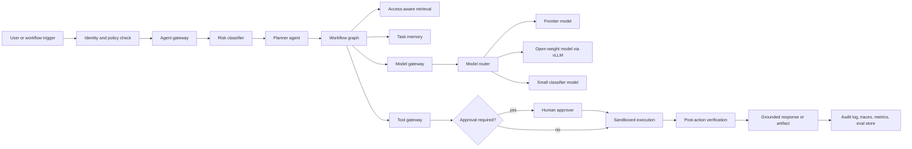

# Enterprise AI Reference Architecture

Enterprise AI architecture should separate business intent, agent behavior, tool access, model execution, and operational controls. The most common failure mode is building a chatbot that quietly accumulates permissions, context, and production influence without an architecture that can be audited.

## Architecture Layers

### 1. Business and Governance Layer

Purpose: define why the system exists and who is accountable.

Required artifacts:

- Business outcome and workflow map.
- System owner, data owner, security owner, model owner, and runtime owner.
- Risk classification for the use case.
- Data classification and retention policy.
- Human approval policy.
- Audit and reporting requirements.
- Exit criteria for production readiness.

Questions to answer:

- What decision or action will this system influence?
- What is the cost of a wrong answer?
- Who approves tool access?
- Who can pause, rollback, or disable the agent?
- What logs are required for audit and incident response?

### 2. Experience Layer

Enterprise AI experiences include chat, embedded copilots, agentic IDEs, command-line agents, workflow automations, Slack/Teams bots, support consoles, and APIs.

Design requirements:

- Explain what the agent can and cannot do.
- Surface confidence, citations, and action status.
- Separate draft, recommendation, and executed action states.
- Provide human approval for high-risk operations.
- Show evidence for retrieved claims.
- Preserve user intent, approvals, and outputs for audit.

### 3. Agent Layer

Agents should be designed as role-bounded actors, not generic omnipotent workers.

Common roles:

- **Planner** - decomposes goals into tasks.
- **Researcher** - gathers and cites evidence.
- **Retriever** - queries enterprise knowledge sources.
- **Executor** - calls approved tools.
- **Critic** - reviews output for correctness, risk, and policy.
- **Router** - chooses model, workflow, or specialist.
- **Supervisor** - coordinates multi-agent execution and handoffs.

For each agent, define:

- Purpose.
- Allowed inputs.
- Allowed tools.
- Allowed data.
- Forbidden actions.
- Required outputs.
- Escalation triggers.
- Evaluation suite.

### 4. Workflow and Graph Layer

Workflow orchestration turns fragile prompt chains into controlled systems.

Recommended primitives:

- Directed graphs for deterministic workflow shape.
- State checkpoints for durability.
- Human interrupts for approval.
- Retry policies for transient tool or model failures.
- Compensation steps for reversible actions.
- Run IDs and trace IDs for every execution.
- Replay capability for debugging and red teaming.

LangGraph is one widely used graph-oriented option with persistence, streaming, memory, and human-in-the-loop patterns. OpenAI Agent Builder and Agents SDK support workflow construction with tools, handoffs, and tracing. Kiro hooks and Claude Code GitHub Actions show how agent workflows can be embedded into developer workflows.

### 5. Knowledge and Memory Layer

Enterprise knowledge must be treated as controlled infrastructure.

Components:

- Document ingestion.
- Chunking and metadata extraction.
- Embeddings and vector indexes.
- Hybrid search.
- Reranking.
- Knowledge graphs.
- Access-aware retrieval.
- Citations and provenance.
- Short-term task state.
- Long-term user or organizational memory.
- Memory write policy.

Controls:

- Retrieval must respect source-system permissions.
- Sensitive fields should be filtered before prompt assembly.
- Memory writes require classification and retention rules.
- Retrieved evidence should be logged by document ID and version.
- RAG pipelines should have grounding, freshness, and hallucination evals.

### 6. Tool and Action Layer

Tools are the action surface. They are also the largest enterprise risk surface.

Tool control requirements:

- Tool registry with owner, scope, schema, and risk level.
- Least-privilege credentials.
- Parameter validation.
- Dry-run mode for risky tools.
- Human approval for high-impact writes.
- Idempotency keys for write operations.
- Rate limits and budgets.
- Output validation.
- Per-call audit logs.

MCP is useful because it standardizes how tools, resources, and prompts are exposed to AI applications, but it does not by itself make tools safe. Enterprise MCP servers need allow-lists, secrets isolation, logging, versioning, and security review.

### 7. Model and Inference Layer

Model strategy is a portfolio decision.

Typical model classes:

- Frontier reasoning models.
- Code models.
- Small fast models.
- Domain-tuned models.
- Open-weight self-hosted models.
- Embedding models.
- Rerankers.
- Classification models.
- Safety and guard models.
- Multimodal models.

Production inference requirements:

- Gateway abstraction.
- Model routing.
- Fallbacks.
- Streaming.
- Quotas.
- Latency budgets.
- Cost budgets.
- Prompt caching.
- Semantic caching.
- KV/prefix cache where supported.
- Structured output enforcement.
- Metrics and traces.

vLLM is a strong self-hosting option where OpenAI-compatible APIs, throughput, GPU efficiency, and operational metrics matter.

### 8. Control and Governance Layer

Controls must wrap the whole system, not sit only at the prompt boundary.

Control types:

- Identity and access control.
- Data loss prevention.
- Secret management.
- Policy engines.
- Input guardrails.
- Output guardrails.
- Tool guardrails.
- Sandbox enforcement.
- Human approval.
- Red-team tests.
- Evals and regression suites.
- Audit logging.
- Incident response.

Map controls to OWASP LLM Top 10, NIST AI RMF / AI 600-1, MITRE ATLAS, and internal enterprise risk frameworks.

## Reference Deployment Topology

```text
user / workflow trigger
  -> enterprise identity and policy
  -> agent gateway
  -> workflow graph
  -> retrieval services
  -> model gateway
  -> inference providers or vLLM
  -> tool gateway
  -> sandbox / connector / API
  -> audit log + traces + metrics + eval store
```

## Production Readiness Checklist

- The use case has a named owner and risk tier.
- Data sources have access-aware retrieval.
- Tool permissions are least privilege.
- Prompt and tool contracts are versioned.
- Critical actions require approval.
- The system emits traces, metrics, and audit events.
- Evals cover accuracy, grounding, security, latency, cost, and tool behavior.
- Red-team tests are part of CI or scheduled checks.
- Rollback and disable paths are documented.
- Incident response owners know how to inspect agent traces.

## Deep Dive: End-to-End Enterprise Agent Flow



Design rule: the model should not be the control plane. The control plane should be the workflow runtime, policy layer, identity system, tool gateway, sandbox, and observability stack.

## Deep Dive: Minimal Service Interfaces

Enterprise AI platforms become easier to govern when every internal service has a small contract.

### Agent Gateway Contract

```json
{
  "request_id": "req_2026_0001",
  "tenant_id": "tenant-a",
  "user_id": "user-123",
  "workflow": "support_rag_answer",
  "risk_tier": "medium",
  "input": {
    "type": "user_message",
    "text": "Summarize the account renewal blockers."
  },
  "policy_context": {
    "data_classes_allowed": ["public", "internal"],
    "tools_allowed": ["search_docs", "create_ticket_draft"],
    "requires_approval_for": ["external_message", "crm_write"]
  }
}
```

### Tool Gateway Contract

```json
{
  "tool_name": "create_ticket_draft",
  "tool_version": "1.2.0",
  "risk_tier": "low",
  "mode": "dry_run",
  "arguments": {
    "project": "ENTAI",
    "title": "Renewal blocker summary",
    "body": "Draft only. Human review required."
  },
  "approval": {
    "required": false,
    "approver": null
  }
}
```

## Deep Dive: Repo and Platform Bootstrap Commands

These commands create a documentation-first reference repo layout. They are intentionally safe: no cloud credentials, no production writes.

```powershell
New-Item -ItemType Directory -Force docs, examples, policies, evals, runbooks | Out-Null
New-Item -ItemType File -Force README.md, SECURITY.md, CONTRIBUTING.md, AGENTS.md | Out-Null
New-Item -ItemType File -Force policies\tool-policy.example.json | Out-Null
New-Item -ItemType File -Force evals\golden-tasks.example.jsonl | Out-Null
New-Item -ItemType File -Force runbooks\agent-incident-runbook.md | Out-Null
```

Suggested platform folders:

```text
enterprise-ai-platform/
  agents/
  workflows/
  prompts/
  tools/
  mcp/
  policies/
  evals/
  traces/
  runbooks/
  infra/
  docs/
```

## Deep Dive: Policy-as-Code Starter

This JSON policy can be used by a gateway, pre-tool hook, CI check, or sandbox launcher.

```json
{
  "policy_version": "2026-06-05",
  "default": "deny",
  "agents": {
    "docs_assistant": {
      "read_paths": ["docs/", "README.md"],
      "write_paths": ["drafts/"],
      "network": "deny",
      "tools": ["search_docs", "summarize"],
      "requires_approval": []
    },
    "coding_agent": {
      "read_paths": ["."],
      "write_paths": ["src/", "tests/", "docs/"],
      "network": "allowlist",
      "network_allowlist": ["github.com", "pypi.org", "registry.npmjs.org"],
      "tools": ["git_diff", "run_tests", "edit_file"],
      "requires_approval": ["delete_file", "deploy", "secret_access"]
    }
  }
}
```

## Deep Dive: Architecture Review Questions

Use this list during design review:

- What are the top five failure modes?
- What is the maximum blast radius of one compromised prompt, document, tool, or MCP server?
- Can the agent complete its task without production credentials?
- Can a human inspect the full evidence chain?
- Can the workflow be replayed from stored traces?
- Can the model be swapped without changing business logic?
- Can a tool be disabled without redeploying the full app?
- What does graceful degradation look like if retrieval, model, or tool execution fails?
- Which controls are preventive, detective, and corrective?
- What must be true before the agent can write to a system of record?
