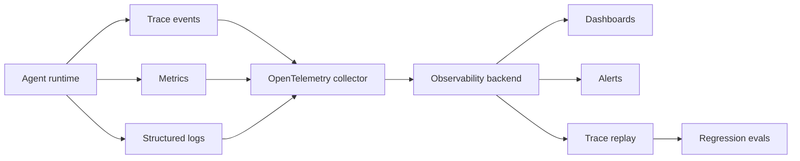
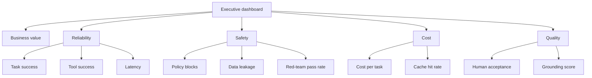

# SRE for Agentic AI

SRE for agentic AI extends classic reliability engineering to systems whose behavior depends on prompts, tools, retrieval, model versions, memory, external APIs, and human approvals.

## What Makes Agent SRE Different

Traditional services fail through code, infrastructure, and dependencies. Agentic systems also fail through:

- Wrong plan.
- Wrong retrieval.
- Wrong tool choice.
- Wrong tool arguments.
- Unsafe autonomy.
- Prompt injection.
- Model drift.
- Context truncation.
- Memory corruption.
- Guardrail false positives or false negatives.
- Cost spikes.
- Human approval bottlenecks.

## Agent SLIs

### Reliability

- Successful task completion rate.
- Tool-call success rate.
- Retry rate.
- Timeout rate.
- Fallback rate.
- Human escalation rate.
- Workflow abandonment rate.

### Quality

- Grounded answer rate.
- Citation precision.
- Structured-output validity.
- Evaluation pass rate.
- Human acceptance rate.
- Rework rate.
- Regression rate after prompt/model change.

### Safety and Security

- Policy violation rate.
- Blocked unsafe action count.
- Prompt-injection detection rate.
- Sensitive-data leakage events.
- Unauthorized tool attempt count.
- Sandbox policy violation count.
- Red-team regression pass rate.

### Performance and Cost

- First-token latency.
- End-to-end task latency.
- Tool latency.
- Queue time.
- Tokens per task.
- Cost per successful task.
- Cache hit rate.
- GPU utilization for self-hosted inference.

## SLO Examples

- 99% of low-risk support answers include at least one valid citation when using RAG.
- 95% of coding-agent PRs run the required test suite before requesting review.
- 99.9% of production-impacting tool calls require a recorded approval.
- 0 high-severity data leakage incidents.
- 90% of approved agent tasks complete under the latency budget.
- Red-team regression suite passes before prompt, model, tool, or policy promotion.

## Observability Requirements

Every agent run should emit:

- Run ID.
- User and tenant.
- Agent name and version.
- Prompt version.
- Model name and version.
- Tool versions.
- Retrieval document IDs and versions.
- Memory reads and writes.
- Policy decisions.
- Human approval events.
- Token usage and cost.
- Latency breakdown.
- Final status.
- Error category.

## Trace Shape

```text
run
  -> user request
  -> policy classification
  -> plan
  -> retrieval calls
  -> model calls
  -> tool calls
  -> approvals
  -> validations
  -> output
  -> metrics
```

Traces should be searchable by incident, user, tool, model, prompt version, data source, and policy decision.

## Incident Response

### Incident Types

- Incorrect answer.
- Unsafe action.
- Data exposure.
- Unauthorized tool call.
- Prompt-injection success.
- Agent loop or runaway cost.
- Model outage.
- Retrieval outage.
- Tool outage.
- CI/CD automation failure.
- Sandbox escape suspicion.

### Response Steps

1. Disable or pause the affected agent, tool, route, or workflow.
2. Preserve traces, prompts, retrieved documents, tool inputs, and outputs.
3. Identify affected users, tenants, and systems.
4. Reproduce using trace replay.
5. Patch policy, prompt, tool, retrieval, model route, or sandbox.
6. Add regression test.
7. Review permissions and blast radius.
8. Communicate impact and remediation.
9. Resume through controlled rollout.

## Change Management

Treat these as production changes:

- Prompt updates.
- Model updates.
- Tool schema changes.
- MCP server changes.
- Retrieval index changes.
- Guardrail policy changes.
- Memory policy changes.
- Sandbox policy changes.
- Routing policy changes.

Required gates:

- Unit tests for deterministic logic.
- Evals for model behavior.
- Red-team tests for risky workflows.
- Load tests for inference changes.
- Review by owner and security for high-risk tools.

## Cost SRE

Agent systems can silently become expensive.

Controls:

- Per-user and per-agent quotas.
- Per-run max token budgets.
- Per-workflow cost budgets.
- Model routing by task value.
- Prompt compression.
- Caching.
- Batch inference.
- Tool-result reuse.
- Alerting on spend anomalies.
- Report cost per successful task, not only total spend.

## Runbook Template

```text
service:
agent:
owner:
risk tier:
dashboards:
logs:
trace query:
kill switch:
common failures:
rollback:
fallback model:
fallback workflow:
security escalation:
customer comms:
post-incident evals:
```

## Deep Dive: Agent Observability Pipeline



## Deep Dive: Trace Event Schema

```json
{
  "trace_id": "trace-001",
  "span_id": "span-003",
  "parent_span_id": "span-002",
  "timestamp": "2026-06-05T17:00:00Z",
  "event_type": "tool_call",
  "agent": "coding_agent",
  "agent_version": "2026.06.05",
  "model": "frontier-reasoning-approved",
  "prompt_version": "prompt-17",
  "tool": "run_tests",
  "tool_version": "1.0.0",
  "risk_tier": "medium",
  "status": "success",
  "latency_ms": 18342,
  "tokens_input": 2048,
  "tokens_output": 512,
  "cost_usd": 0.048,
  "policy_decision": "allow",
  "approval_id": null
}
```

Run the sample SLO report:

```powershell
python examples\agent_slo_report.py examples\sample_traces.jsonl
```

## Deep Dive: Alert Rules

Example alert policy:

```yaml
alerts:
  - name: agent_high_error_rate
    condition: "task_failure_rate > 0.05 for 10m"
    severity: page
  - name: prompt_injection_spike
    condition: "prompt_injection_block_count > 20 for 15m"
    severity: page
  - name: runaway_cost
    condition: "cost_usd_per_hour > budget_usd_per_hour * 1.5 for 30m"
    severity: ticket
  - name: approval_bypass_attempt
    condition: "unauthorized_tool_attempt_count > 0"
    severity: page
```

## Deep Dive: Incident Timeline Script Pattern

```powershell
python examples\trace_replay.py examples\sample_traces.jsonl --trace-id trace-001
```

Expected incident evidence:

- User request.
- Model calls.
- Retrieved documents.
- Tool calls.
- Policy decisions.
- Human approvals.
- Final output.
- Cost and latency.
- Failure category.

## Deep Dive: SLO Dashboard Sections



## Deep Dive: Production Change Checklist

Before changing a model, prompt, tool, MCP server, or retrieval index:

```powershell
git checkout -b change/model-route-update
python examples\eval_harness.py evals\sample_eval_cases.jsonl
python examples\red_team_harness.py evals\sample_red_team_cases.jsonl
python examples\agent_slo_report.py examples\sample_traces.jsonl
```

Checklist:

- Golden evals pass.
- Red-team regressions pass.
- Latency remains within SLO.
- Cost impact is understood.
- Rollback route is documented.
- Owners approved.
- Trace schema remains compatible.
