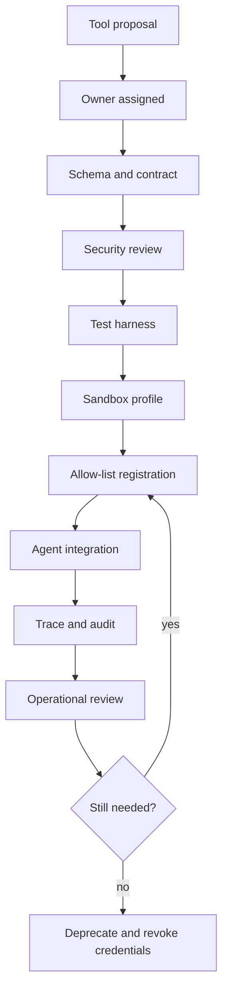
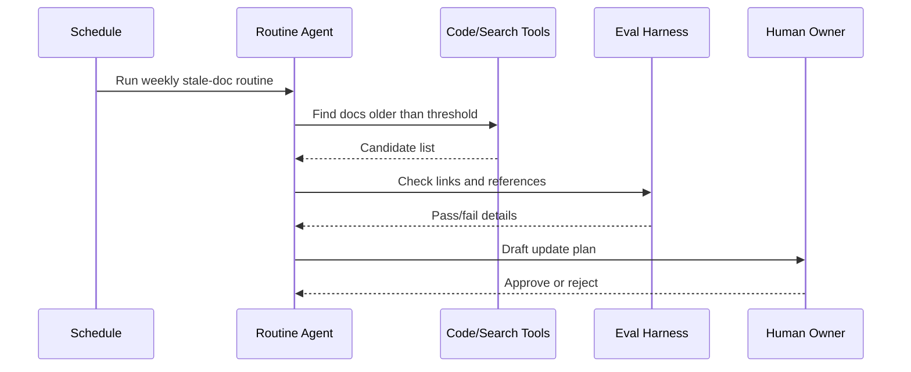

# Tools, IDEs, CLIs, Skills, and Routines

Enterprise agents become useful when they can use tools. Enterprise agents become dangerous when tools are not governed. The goal is to make tool access explicit, versioned, observable, testable, and revocable.

## Tool Taxonomy

| Tool Type | Examples | Risk |
| --- | --- | --- |
| Read-only knowledge tools | Docs search, vector search, wiki, code search | Data leakage, stale evidence. |
| Low-risk write tools | Draft docs, create local files, comments | Incorrect or noisy artifacts. |
| System-of-record tools | CRM, ERP, ticketing, HR, finance | Business process corruption. |
| Developer tools | Git, CI, package managers, shell, IDE | Supply chain, destructive commands. |
| Cloud tools | AWS, Azure, GCP, Kubernetes | Outage, cost, data exposure. |
| Communication tools | Email, Slack, Teams, LinkedIn | Reputational and privacy risk. |
| Browser tools | Web navigation, forms, downloads | Prompt injection and phishing. |
| Data tools | SQL, BI, data warehouse, notebooks | Data exfiltration and wrong analysis. |

## Enterprise Tool Contract

Every tool should have:

- Name.
- Owner.
- Purpose.
- Risk tier.
- Input schema.
- Output schema.
- Authentication method.
- Permission boundary.
- Rate limit.
- Timeout.
- Idempotency behavior.
- Audit event schema.
- Error taxonomy.
- Dry-run support if applicable.
- Approval requirement.
- Test harness.

## MCP in Enterprise

MCP standardizes how agents connect to tools, resources, prompts, and context. It is powerful because tools become portable across clients. It is risky because MCP servers can execute code and expose enterprise resources.

Enterprise MCP requirements:

- Registry of approved MCP servers.
- Server owner and review status.
- Version pinning.
- Source-code and package review.
- Secret handling policy.
- Network and filesystem scope.
- Tool allow-list.
- Per-tool audit logs.
- Tenant isolation.
- Disable unapproved local MCP servers in managed environments.

Kiro provides enterprise-oriented MCP governance patterns through allow-lists. Claude Code and OpenAI Codex can connect to MCP servers. Treat MCP servers as privileged software, not as passive configuration.

## Skills

Skills are reusable instructions, assets, scripts, or workflows that help agents perform specialized tasks.

Good skill design:

- Narrow domain.
- Clear trigger conditions.
- Minimal required context.
- Explicit allowed tools.
- Reusable templates.
- Test examples.
- Known limitations.
- Version history.

Enterprise examples:

- Secure code review skill.
- Terraform migration skill.
- Incident summary skill.
- Customer support escalation skill.
- SOC investigation skill.
- RAG ingestion QA skill.
- API client generation skill.
- Release note skill.

## Routines

Routines are repeatable workflows that agents can execute with predictable controls.

Examples:

- Daily dependency review.
- Weekly stale ticket cleanup.
- PR risk summary.
- Incident timeline generation.
- Postmortem draft.
- Runbook validation.
- Monthly access review.
- Customer escalation summary.

Routine template:

```text
name:
owner:
trigger:
inputs:
steps:
tools:
approval gates:
outputs:
logs:
failure mode:
rollback:
evals:
```

## Prompt Contracts

Prompts should be managed like production configuration.

Prompt contract fields:

- Purpose.
- Input variables.
- Output schema.
- Policy constraints.
- Tool access.
- Model class.
- Temperature and decoding policy.
- Examples.
- Failure and refusal behavior.
- Eval suite.
- Version.

Avoid mixing policy, task logic, examples, and runtime data into one unstructured prompt. Separate the layers so changes can be reviewed.

## Agentic IDE / CLI Comparison

| Capability | OpenAI Codex | Claude Code | Kiro | Antigravity |
| --- | --- | --- | --- | --- |
| Local coding agent | Yes | Yes | Yes | Yes |
| IDE workflow | Yes | Yes | Yes | Yes |
| CLI workflow | Yes | Yes | Yes | Yes |
| Cloud / delegated tasks | Yes | Through integrations and actions | Web/sandbox capabilities | Platform-oriented workflows |
| Project instructions | `AGENTS.md` style repo guidance | `CLAUDE.md` | Steering files | Project/workspace instructions |
| Tool extensibility | MCP, shell, local tools | MCP, SDK, tools | MCP, hooks, powers | CLI, SDK, tools |
| CI/CD automation | SDK / workflows | GitHub Actions | Hooks and CLI patterns | Scheduled and CLI patterns |
| Enterprise concern | Sandbox, approvals, branch policy | Secrets, tool permissions, CI permissions | Hook governance, MCP policy | Workspace and filesystem scope |

## OpenClaw, NemoClaw, and OpenShell

These tools represent a broader pattern: channel-connected self-hosted agents that can route messages into coding agents, shell environments, and sandboxed runtimes.

Potential value:

- One chat surface for multiple agents.
- Self-hosting.
- Channel integration.
- Sandbox-oriented execution.
- Skill ecosystems.
- Personal or team automation.

Enterprise concerns:

- Channel identity is not the same as enterprise authorization.
- Messaging content is untrusted input.
- Skills can become supply-chain risk.
- Shell and browser access require strong sandboxing.
- Agent memory can retain sensitive context.
- Remote channels can become command surfaces.

Use only after security review, with least privilege, logging, sandboxing, and allow-listed skills.

## References

- OpenAI Codex CLI: https://help.openai.com/en/articles/11096431
- OpenAI Docs MCP: https://platform.openai.com/docs/docs-mcp
- Anthropic MCP: https://docs.anthropic.com/en/docs/mcp
- Claude Code setup: https://docs.anthropic.com/en/docs/claude-code/getting-started
- Kiro docs: https://kiro.dev/docs/
- Kiro MCP governance: https://kiro.dev/docs/enterprise/governance/mcp/
- Kiro hooks: https://kiro.dev/docs/hooks/
- Google Antigravity docs: https://www.antigravity.google/docs/files
- OpenClaw docs: https://docs.openclaw.ai/
- NemoClaw docs: https://docs.nvidia.com/nemoclaw/user-guide/openclaw/reference/commands

## Deep Dive: Tool Lifecycle Diagram



## Deep Dive: Tool Contract JSON

```json
{
  "name": "create_jira_ticket",
  "version": "1.0.0",
  "owner": "platform-engineering",
  "risk_tier": "medium",
  "description": "Create a draft engineering ticket. Production-impacting tickets require human review.",
  "auth": {
    "type": "service_account",
    "scope": "jira:issue:create",
    "secret_ref": "vault://ai-tools/jira-draft-writer"
  },
  "input_schema": {
    "type": "object",
    "required": ["project", "title", "body"],
    "properties": {
      "project": { "type": "string", "maxLength": 20 },
      "title": { "type": "string", "maxLength": 160 },
      "body": { "type": "string", "maxLength": 4000 },
      "labels": { "type": "array", "items": { "type": "string" } }
    }
  },
  "approval": {
    "required_when": ["external_customer_visible", "production_change"]
  },
  "audit": {
    "log_arguments": true,
    "redact_fields": ["body.private_notes"]
  }
}
```

Validate contracts:

```powershell
python examples\tool_contract_validator.py examples\sample_tool_contract.json
```

## Deep Dive: MCP Server Review Checklist

Commands:

```powershell
git status --short
rg -n "process.env|subprocess|exec|spawn|shell|token|secret|password" .
rg -n "http://|https://|fetch|requests|urllib|axios" .
```

Questions:

- What data can the MCP server read?
- What actions can it perform?
- Does it run local shell commands?
- Does it make outbound network calls?
- How are credentials loaded?
- Does it support tenant isolation?
- Are tools read-only, write-only, or mixed?
- Are tool descriptions prompt-injection resistant?
- Are dangerous tools disabled by default?

## Deep Dive: Skill Template

```markdown
# Skill: Secure Pull Request Review

## Trigger

Use when reviewing application code, infrastructure code, auth logic, data access, or agent tool integrations.

## Inputs

- Pull request diff.
- Changed files.
- Tests run.
- Threat model.

## Steps

1. Identify sensitive files and permission changes.
2. Check input validation and output encoding.
3. Check authentication and authorization.
4. Check secrets and logging.
5. Check agent-specific risks: prompt injection, tool abuse, excessive agency.
6. Produce findings ordered by severity.

## Output

- Findings.
- Required fixes.
- Recommended tests.
- Residual risk.
```

## Deep Dive: Routine Mermaid Diagram



## Deep Dive: CLI Notes

Examples below are intentionally conservative. Always prefer the current official install and auth docs for each tool.

```powershell
# Claude Code help and MCP management
claude --help
claude mcp --help

# Git safety checks before any agentic coding task
git status --short
git branch --show-current
git remote -v

# Search project instructions for agents
rg -n "AGENTS.md|CLAUDE.md|steering|hooks|mcp" .
```

Antigravity CLI documentation currently describes CLI installation, subagents, task panels, scheduled tasks, and status-line configuration. Kiro documentation describes specs, steering, hooks, MCP, and governance controls. Because these products move quickly, pin enterprise guidance to the official docs and record the documentation date in internal standards.
